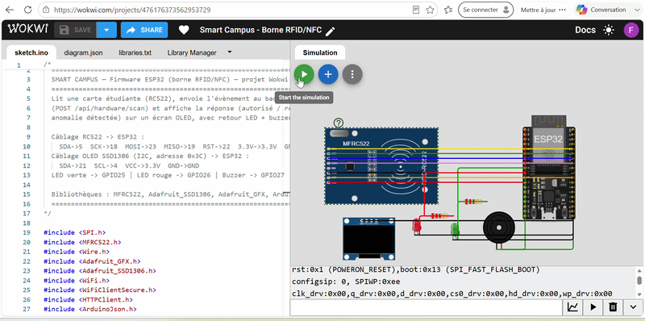
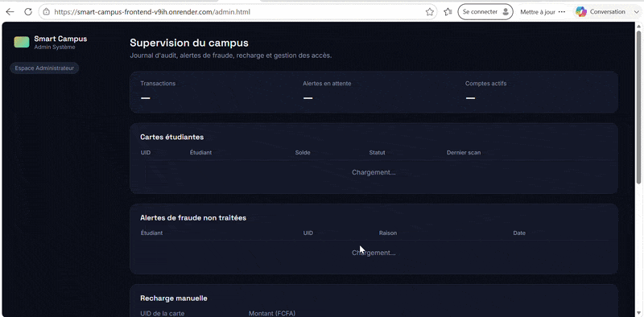

# Smart Campus — Carte étudiante intelligente et sécurisée

Plateforme complète de gestion de carte étudiante multiservices : identification
par carte RFID/NFC, paiement électronique (restaurant, bibliothèque, transport),
détection d'anomalie inspirée de l'IA, et 3 espaces web dédiés (Étudiant,
Technicien, Administrateur).

> Projet transversal — Informatique · Télécom · Intelligence Artificielle · Sécurité
>  Réalisé par Fatou Gueye

* 🔗 **Plateforme en ligne :** https://smart-campus-frontend-v9ih.onrender.com
* ⚙️ **API backend :** https://smart-campus-backend-ne5z.onrender.com/api/health
* 🔧 **Simulation matérielle (Wokwi) :** https://wokwi.com/projects/476176373562953729

---

## Aperçu



## Fonctionnalités

- **Authentification sécurisée** par rôle (Étudiant / Technicien / Administrateur), avec JWT et mots de passe hachés (bcrypt)
- **Carte étudiante virtuelle** : solde, historique des transactions, blocage immédiat en cas de perte/vol (réactivation par un technicien)
- **Bornes IoT (ESP32 + RFID RC522)**, simulées sur Wokwi, qui communiquent en temps réel avec l'API
- **Détection d'anomalie** sur les scans de carte (pattern de type rejeu/clonage), avec journal de fraude dédié pour l'administrateur
- **Back-office complet** : association de cartes, diagnostic des bornes, recharge manuelle, gestion des accès, audit des transactions

## Architecture

```
Carte NFC/RFID → Borne ESP32 (Wokwi) → API REST (Express, Render) → PostgreSQL (Neon)
                                              ↓
                          Dashboards web (Étudiant / Technicien / Admin) — Render Static Site
```

```
smart-campus/
├── hardware/     Firmware ESP32 (Wokwi) + schéma de câblage
├── database/     Schéma PostgreSQL + données de démonstration
├── backend/      API REST Express (auth JWT, 3 rôles, endpoint bornes IoT)
└── frontend/     Login + 3 tableaux de bord (HTML/CSS/JS)
```

## Stack technique

| Domaine | Technologies |
|---|---|
| Matériel / IoT | ESP32, RFID RC522, écran OLED SSD1306, Wokwi |
| Backend | Node.js, Express, PostgreSQL (Neon), JWT, bcrypt — hébergé sur Render |
| Frontend | HTML / CSS / JavaScript (vanilla) — hébergé sur Render (Static Site) |
| Sécurité | Hachage des mots de passe, contrôle d'accès par rôle, clé d'authentification dédiée aux bornes, connexions chiffrées TLS |

## Pourquoi ce projet va au-delà d'une simple démo

- **Sécurité pensée dès la conception** : les bornes matérielles s'authentifient avec une clé dédiée (pas un compte utilisateur), séparée du système d'authentification JWT des humains.
- **Détection de fraude réaliste** : l'heuristique de vélocité de scan est un point d'entrée clairement documenté vers un vrai modèle de machine learning (Isolation Forest / Random Forest) entraîné sur l'historique des transactions.
- **Contrat de données unique** : le firmware ESP32 et l'API partagent exactement le même schéma JSON, ce qui permet de brancher une vraie borne physique sans changer une ligne de l'API.
- **Séparation claire des responsabilités** : matériel, base de données, API et interface sont dans 4 dossiers indépendants, chacun déployé et testable indépendamment.

## Limitation connue

Le circuit complet (scan de carte → borne ESP32 → API cloud → mise à jour de la
base de données → affichage sur le dashboard) a été **testé et validé avec
succès de bout en bout**. La connexion HTTPS entre le firmware ESP32 (simulé
sur Wokwi) et l'hébergement gratuit de l'API (Render) peut cependant être
intermittente selon la charge du moment — un comportement documenté pour ce
type de négociation TLS depuis un microcontrôleur vers une infrastructure
cloud gratuite. En cas d'échec, il suffit généralement de refaire 2 à 3 scans
de suite pour que la connexion passe. Si elle ne passe toujours pas après
plusieurs essais, les GIF de démonstration ci-dessus montrent le
fonctionnement complet déjà validé. Le reste de la chaîne (lecture RFID,
affichage OLED, LED, buzzer, logique métier, base de données, dashboards)
fonctionne de façon fiable à chaque test. Une infrastructure payante ou un
backend "always-on" éliminerait cette intermittence.

## Lancer le projet en local

### Comptes de démonstration
| Rôle | Email | Mot de passe |
|---|---|---|
| Administrateur | admin@campus.edu | Admin#2026 |
| Technicien | tech@campus.edu | Tech#2026 |
| Étudiant | awa.diop@campus.edu | Student#2026 |

### 1. Base de données
```bash
createdb smart_campus
psql -d smart_campus -f database/schema.sql
# Générer les vrais hachages avant de charger seed.sql :
node backend/scripts/hash.js "Admin#2026"
node backend/scripts/hash.js "Tech#2026"
node backend/scripts/hash.js "Student#2026"
psql -d smart_campus -f database/seed.sql
```

### 2. Backend
```bash
cd backend
cp .env.example .env   
npm install
npm run dev             # http://localhost:4000
```

### 3. Frontend
```bash
cd frontend/public
python3 -m http.server 5500
# puis ouvrir http://localhost:5500/index.html
```

### 4. Simulation matérielle (Wokwi)
1. Ouvre le projet public : https://wokwi.com/projects/476176373562953729
2. Ou recrée-le : crée un projet ESP32 sur [wokwi.com](https://wokwi.com), colle `hardware/sketch.ino` et `hardware/diagram.json`, installe les bibliothèques (MFRC522, Adafruit SSD1306, Adafruit GFX, ArduinoJson)
3. Lance la simulation, scanne une carte, observe le résultat sur l'écran OLED et dans le dashboard Admin

## Déploiement

- **Base de données** : [Neon](https://neon.tech) (PostgreSQL gratuit)
- **Backend** : [Render](https://render.com) (Web Service, connecté à ce dépôt GitHub)
- **Frontend** : [Render](https://render.com) (Static Site, `frontend/public`)

## Licence

Projet académique — libre de réutilisation à des fins d'apprentissage.
